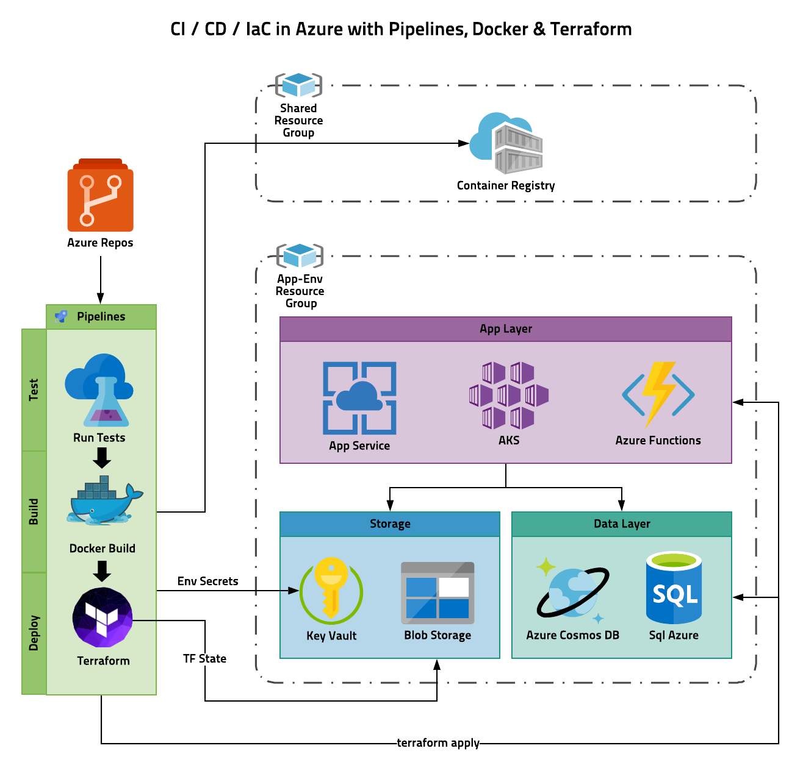

# CI/CD/IaC Scaffolding using Azure Pipelines, Docker and Terraform

## Getting Started

Begin by copying all the files and folders in this repo into your web app project. These configuration files and scripts bootstrap the process of setting up a very clean and modern CI/CD in Azure Pipelines using Docker and Terraform. A Resource group is created for each app environment you set up, meaning you can create new environments and tear them down with very little effort. Terraform keeps a "tfstate" file that tracks the resources it has deployed, so that it can calculate changes and update the environment accordingly. In order to do this in a CD pipeline, we store the tfstate file in Azure blob storage. All the keys and secrets generated are stored securely in a Key Vault. The Key Vault, Blob storage for tfstate, and all the resources created by terraform are self contained in the app environment's resource group, meaning that when you delete it all traces of the app environment are blown away. At first glance it might seem like creating a Key Vault per app environment is overkill, but this is Microsofts recommended approach.

The only thing not contained in the app environment resource group is the Azure Container Registry (ACR) where your docker containers are stored. You need to set this up on your own if you don't already have one. This is because most people will use one ACR across multiple applications. Also, our build process builds environment agnostic docker containers which means one container per build, and environment specific configurations are passed in as environment variables.

## Architecture Overview

## Configuring your developer machine

1. Run `scripts/1_InstallDevDependencies.ps1` from an admin powershell session to install the developer dependencies.

2. Run `scripts/2_CreateDevCert.ps1` to create a self-signed cert so kestral can use https on localhost

## Install Terraform pipeline module from the Azure marketplace

<https://marketplace.visualstudio.com/items?itemName=ms-devlabs.custom-terraform-tasks>

## Creating Service Connections for Pipelines

Pipelines requires two service connections, one to access the Azure Container Registry containing the docker image, and one that allows terraform to manage azure resources.

Navigate to [Azure DevOps Project] -> Settings -> Pipelines -> Service Connections:

### Create a 'new Service Connection' of type 'Azure Resource Manager'

This allows terraform to create, configure and modify azure resources

- Authentication method: Service principal (automatic)
- Scope Level: Subscription
- Subscription: [mysubscription]
- Resource Group: Leave blank
- Service Connection Name: [mysubscription]-arm-service-connection
- Description: Service Connection between the DevOps project and [mysubscription] which allows Pipelines to terraform resources in the subscription
- [check] Grant access permissions to all pipelines

### Create a new Service Connection of type 'Docker Registry'

This allows Pipelines to push and pull docker containers to and from the Azure Container Registry. If you change the Azure Container Registry, you need to create a new Service Connection then update the dockerRegistryServiceConnection pipeline variable.

- Registry Type: 'Azure Container Registry'
- Subscription: [mysubscription]
- Azure container registry: [myregistry]
- Service Connection Name: [mysubscription]-[myregistry]-service-connection
- Description: Service Connection between the DevOps project and the [myregistry] which allows Pipelines to access docker images in the registry
- [check] Grant access permissions to all pipelines`

## Setting up Azure Pipelines and Terraform State management

1. Create the two Service Connections that Pipelines needs to access your Azure Container Registry and manage Azure resources (see instructions in azure-pipelines.yml)
   On your new ARM Service Principal click Manage Service Principal and copy the Application ID because the next script will ask for it.

2. Run `scripts/3_CreateAzureTfstate.ps1` to configure Pipelines and setup Terraform state management in Azure Blob storage
   Run this script once for each environment you want to configure (i.e. dev, qa, prod)

3. Update your Dockerfile, azure-pipelines.yml, and main.tf with anything specific to your application

4. Under DevOps->[Project]->Pipelines->Environments, select "appName-prod" or create it if it doesn't exist.

5. Under the menu, select "Approvals and Checks" and create an approval.

## Troubleshooting

### If Docker Fails to start with this Error

> Unable to stop - The running command stopped because the preference variable "ErrorActionPreference" or common parameter is set to Stop: Service 'Hyper-V Host Compute Service (vmcompute)' cannot be started due to the following error: Cannot start service vmcompute on computer '.'.
> at Docker.Core.Pipe.NamedPipeClient.`<TrySendAsync>`d__5.MoveNext()
> --- End of stack trace from previous location where exception was thrown ---
> at System.Runtime.ExceptionServices.ExceptionDispatchInfo.Throw()
> at Docker.Core.Pipe.NamedPipeClient.Send(String action, Object[] parameters)
> at Docker.Actions.DoStart(SynchronizationContext syncCtx, Boolean showWelcomeWindow, Boolean executeAfterStartCleanup)
> at Docker.Actions.<>c__DisplayClass24_0.`<Start>`b__0()
> at Docker.ApiServices.TaskQueuing.TaskQueue.<>c__DisplayClass17_0.<.ctor>b__1()

Follow these steps:

1. Open "Window Security"
2. Open "App & Browser control"
3. Click "Exploit protection settings" at the bottom
4. Switch to "Program settings" tab
5. Select "Add Program to Customize" and locate it here "C:\WINDOWS\System32\vmcompute.exe"
6. Scroll down to "Code flow guard (CFG)" and uncheck "Override system settings"
7. Start vmcompute from powershell "net start vmcompute"
